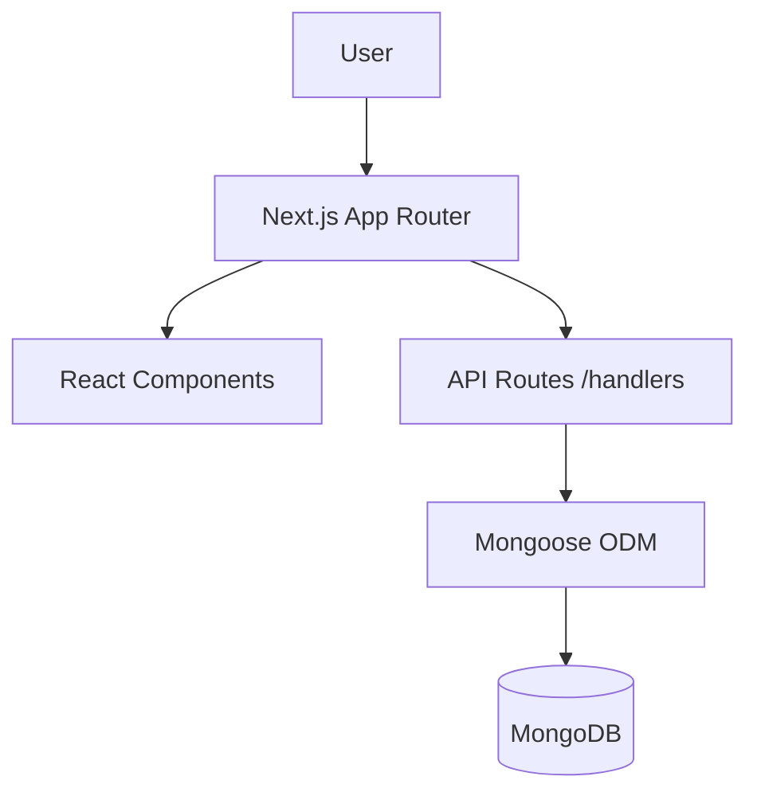

<div align="center">

# 🍇 Vineyard

</div>

> **Cultivate your best ideas.**  
> A developer-first idea management system built for clarity, evolution, and connection.


---

## 📖 Overview

Vineyard is more than just a note-taking app. It's a **living repository** for your thoughts, designed to treat ideas as evolving documents rather than static text. With a focus on developer experience ("DX"), it combines the speed of Markdown with the power of a relational graph.

### ✨ Key Features

-   **🌱 Idea Lifecycle**: Track ideas from `Seed` → `Brewing` → `Prototyped` → `Shipped`.
-   **📝 Markdown-First**: Full GFM support with live preview. Write distinct summaries and change notes for every update.
-   **🕰️ Time Travel**: Automatic revision history. Never lose a previous version of your thought process.
-   **🕸️ Knowledge Graph**: Visualize how your ideas connect with a force-directed graph (d3-style physics). Link ideas as "Derived From", "Inspired By", or "Contradicts".
-   **🎨 GitLab-Inspired UI**: A clean, technical aesthetic using Tailwind CSS. Dark sidebar headers, crisp typography, and high-contrast badges.
-   **⚡ Developer Ready**: Built with Next.js App Router, Server Actions/API Routes, and fully typed with TypeScript.

---

## 🚀 Getting Started

### Prerequisites

-   **Node.js** 18+
-   **MongoDB** (Local instance or Atlas URI)

### Installation

1.  **Clone the repository**
    ```bash
    git clone https://github.com/yourusername/vineyard.git
    cd vineyard
    ```

2.  **Install dependencies**
    ```bash
    npm install
    ```

3.  **Configure Environment**
    Create a `.env.local` file in the root directory:
    ```env
    MONGODB_URI=mongodb://localhost:27017/vineyard
    ```

4.  **Seed Database (Optional)**
    Populate your garden with some initial seeds:
    ```bash
    # Ensure server is running first
    npm run dev
    # In a new terminal:
    curl -X POST http://localhost:3000/api/seed
    ```

5.  **Start Developing**
    ```bash
    npm run dev
    ```
    Visit [http://localhost:3000](http://localhost:3000) to enter the vineyard.

---

## 🏗️ Architecture

Vineyard follows a modern **Full-Stack Next.js** architecture.



### Directory Structure

-   `src/app`: App Router pages and API endpoints.
-   `src/components`: Reusable UI components (IdeaForm, Modal, Graph).
-   `src/lib`: Database connections (`db.ts`) and Mongoose Schemas (`models.ts`).
-   `__tests__`: Jest unit and integration tests.

---

## 🧪 Testing

We use **Jest** and **React Testing Library** to ensure reliability.

```bash
# Run unit tests
npm test
```

---

## 🤝 Contributing

1.  Fork the Project
2.  Create your Feature Branch (`git checkout -b feature/AmazingFeature`)
3.  Commit your Changes (`git commit -m 'Add some AmazingFeature'`)
4.  Push to the Branch (`git push origin feature/AmazingFeature`)
5.  Open a Pull Request

---

## 📄 License

Distributed under the MIT License. See `LICENSE` for more information.

---

<p align="center">
  Built with ❤️ by Antigravity
</p>
